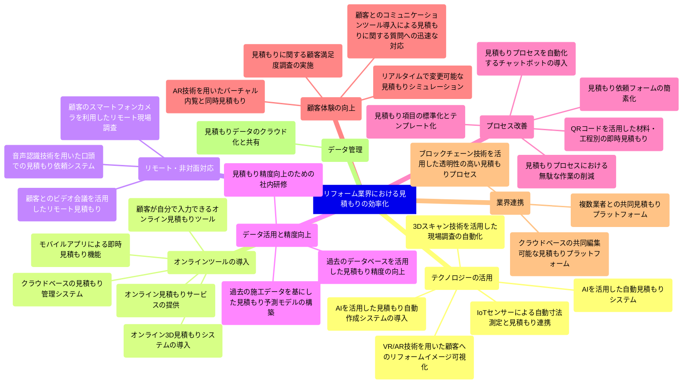

# ブレーンストーミングの結果 / Result of Brainstorming

## 設定 / Setting
- テーマ / Theme: リフォーム業界における見積もりの効率化
- アイデア個数 / Number of Ideas: 10
- 自由度 / Freedom: 0.7

## 各AIが出したアイデアリスト / Idea List
### openai
- AIを活用した自動見積もりシステム
- 顧客が自分で入力できるオンライン見積もりツール
- 3Dスキャン技術を活用した現場調査の自動化
- 過去のデータベースを活用した見積もり精度の向上
- モバイルアプリによる即時見積もり機能
- クラウドベースの見積もり管理システム
- リアルタイムで変更可能な見積もりシミュレーション
- 複数業者との共同見積もりプラットフォーム
- 顧客とのビデオ会議を活用したリモート見積もり
- 見積もりプロセスを自動化するチャットボットの導入
### anthropic
- オンライン3D見積もりシステムの導入
- AIを活用した自動見積もり作成ツール
- 顧客のスマートフォンカメラを利用したリモート現場調査
- 過去の施工データを基にした見積もり予測モデルの構築
- QRコードを活用した材料・工程別の即時見積もり
- 音声認識技術を用いた口頭での見積もり依頼システム
- ブロックチェーン技術を活用した透明性の高い見積もりプロセス
- AR技術を用いたバーチャル内覧と同時見積もり
- IoTセンサーによる自動寸法測定と見積もり連携
- クラウドベースの共同編集可能な見積もりプラットフォーム
### google
- AIを活用した見積もり自動作成システムの導入
- VR/AR技術を用いた顧客へのリフォームイメージ可視化
- オンライン見積もりサービスの提供
- 見積もり項目の標準化とテンプレート化
- 見積もり依頼フォームの簡素化
- 見積もりデータのクラウド化と共有
- 顧客とのコミュニケーションツール導入による見積もりに関する質問への迅速な対応
- 見積もり精度向上のための社内研修
- 見積もりプロセスにおける無駄な作業の削減
- 見積もりに関する顧客満足度調査の実施

## マインドマップ / Mind Map



## クラス図（疑似KJ法） / Class Diagram (pseudo KJ method)
```mermaid
classDiagram
    見積もりシステム <|-- AIシステム
    見積もりシステム <|-- オンラインツール
    見積もりシステム <|-- モバイルアプリ
    見積もりシステム <|-- クラウドシステム
    見積もりシステム <|-- チャットボット
    見積もりシステム <|-- ブロックチェーンシステム
    
    技術活用 <|-- 3Dスキャン
    技術活用 <|-- VR/AR
    技術活用 <|-- IoTセンサー
    技術活用 <|-- 音声認識
    
    データ管理 <|-- 過去データ分析
    データ管理 <|-- 見積もり予測モデル
    データ管理 <|-- 標準化とテンプレート化
    
    顧客対応 <|-- ビデオ会議
    顧客対応 <|-- リモート現場調査
    顧客対応 <|-- コミュニケーションツール
    顧客対応 <|-- 顧客満足度調査
    
    業務改善 <|-- プロセス自動化
    業務改善 <|-- 社内研修
    業務改善 <|-- 無駄な作業の削減
    
    見積もりシステム --> 技術活用
    見積もりシステム --> データ管理
    見積もりシステム --> 顧客対応
    見積もりシステム --> 業務改善
```

## 各AIによる評価 / Evaluation
### openai
- Overall Evaluation:
  - このマインドマップは、リフォーム業界における見積もりの効率化に関する主要な要素を網羅しており、各要素がどのように関連しているかを明確に示しています。

- Good Points:
  - 見積もりシステムが多様な技術（AI、オンラインツール、モバイルアプリ、クラウドシステム、チャットボット、ブロックチェーンシステム）を活用している点。
  - 技術活用、データ管理、顧客対応、業務改善といった主要なカテゴリが明確に分かれており、それぞれのカテゴリ内で具体的な技術や方法が示されている点。
  - データ管理において、過去データ分析や見積もり予測モデル、標準化とテンプレート化が含まれている点。

- Areas for Improvement:
  - 各要素間の具体的な連携方法やフローが示されていないため、実際の運用イメージがつかみにくい点。
  - 顧客対応における具体的なツールや方法の詳細が不足している点。
  - 業務改善の具体的な効果や期待される成果についての記述がない点。
### anthropic
- 総合評価:
  - リフォーム業界の見積もり効率化に関する包括的なマインドマップであり、多角的なアプローチを示している

- 良い点:
  - 見積もりシステムの多様な形態（AI、オンライン、モバイル等）を網羅している
  - 技術活用、データ管理、顧客対応、業務改善など、効率化に必要な主要な側面をカバーしている
  - 最新技術（3Dスキャン、VR/AR、ブロックチェーン等）の導入を考慮している
  - 顧客満足度調査やリモート現場調査など、顧客中心のアプローチを含んでいる

- 改善点:
  - コスト削減や収益性向上などの財務的側面が明示的に示されていない
  - 法規制やコンプライアンスに関する考慮が不足している
  - 競合他社との差別化要因が明確でない
  - 従業員のスキル向上や人材育成に関する詳細が限定的である
### google
## リフォーム業界における見積もりの効率化 マインドマップ評価

- **Overall Evaluation:**
  - リフォーム業界における見積もりの効率化に向けた多岐にわたる要素を網羅しており、概ね良い。
- **Good Points:**
  - 見積もりシステムの多様な選択肢を提示している。
  - 技術活用、データ管理、顧客対応、業務改善といった重要な側面をカバーしている。
  - 各要素間の関連性を示す矢印により、システム全体像を把握しやすい。
- **Areas for Improvement:**
  - 各要素の詳細な説明や具体的な例が不足している。
  - 各要素間の連携やシナジー効果が明確でない。
  - 具体的な課題解決策や具体的な導入事例が示されていない。
