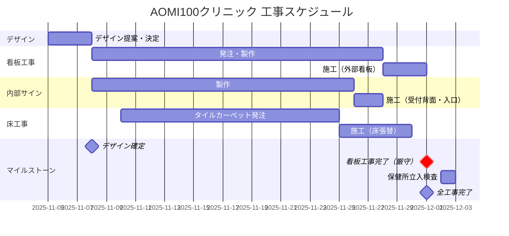
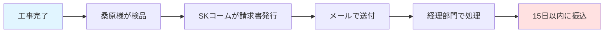

# AOMI100クリニック 看板・内装刷新プロジェクト 要件定義書

**作成日：** 2025年11月5日
**最終更新：** 2025年11月6日
**打ち合わせ日時：** 2025年11月5日 13:00-15:00（約2時間）
**クライアント：** AOMI100クリニック（青海2-4-32 タイム24ビル1階）
**ご担当者：** 桑原様
**弊社担当：** 末武、木村
**バージョン：** 1.2

---

## 📋 目次

1. [プロジェクト概要](#プロジェクト概要)
2. [最重要制約事項](#最重要制約事項)
3. [工事内容詳細](#工事内容詳細)
4. [デザイン要件](#デザイン要件)
5. [スケジュール](#スケジュール)
6. [施工条件・制約](#施工条件制約)
7. [予算・支払い条件](#予算支払い条件)
8. [承認・決定プロセス](#承認決定プロセス)
9. [リスク・課題](#リスク課題)

---

## プロジェクト概要

### プロジェクト目的
クリニック名称変更に伴うブランド刷新
- 旧名称：サンフィルドクリニック
- 新名称：AOMI100クリニック

### 背景
- 保健所の営業許可申請のため、看板変更が必須
- 東京都への申請は完了済み
- **看板が完成しないと保健所申請を進められない**
- 内装レベル（5000-6000万円規模）に見合う品質が必要

### プロジェクトスコープ
| 項目 | 内容 | 優先度 |
|------|------|--------|
| 外部看板 | 正面看板の全面刷新 | 🔴 最優先 |
| 入口サイン | ガラス面のカッティングシート貼り替え | 🔴 最優先 |
| 受付背面サイン | 立体文字サイン新規制作 | 🔴 最優先 |
| 壁面装飾 | クロス張替+サイン設置 | 🟡 優先 |
| タイルカーペット | 床材張替 | 🟢 通常 |
| 壁補修 | クラック補修（別業者対応予定） | △ 保留 |

---

## 最重要制約事項

### ⚠️ 絶対厳守事項

#### 1. 納期制約（最重要）
```
【デッドライン】
看板工事完了：12月1日まで
理由：保健所の立入検査を実施するため（検査自体は1日で完了）

【逆算スケジュール】
- デザイン決定：11月8日まで（2-3日以内）← 超特急
- 発注・製作：11月中旬～下旬
- 施工完了：12月1日
```

#### 2. 作業不可日
- **12月12-14日：ビル全館停電**（入室不可）
- **11月17日：NG日**
- **12月26日以降：クリニック終業**

#### 3. 理想的なスケジュール
> 「11月中に工事完了 → 12月15日支払い」が最も望ましい

---

## 工事内容詳細

### 1. 外部看板（正面）

#### 現状
- 発光式看板（内側から光る一体成形タイプ）
- 青色のバックライト付き
- 高級感のある造り

#### 要件
**品質基準：**
- 内装レベル（5000-6000万円相当）に負けない高級感
- チープに見えないこと（最重要）
- 側面の質感も重要
### デザイン
- パターンAは以下のデザインで、白部分を切り抜きで発光するイメージ
![[スクリーンショット 2025-11-06 9.48.37.png]]
- パターンBはこちらのイメージでも良さそう
![[スクリーンショット 2025-11-06 9.50.27.png]]

**提案する2パターン：**

##### パターンA：切り抜き式（発光）
```
【仕様】
- 白い文字部分だけを切り抜く
- 裏側に薄いアクリル板を貼る
- 既存のバックライトを活用
- 文字以外の部分は濃い色

【メリット】
- 発光するため視認性が高い
- 既存の電気設備を流用可能
- コントラストが明確

【デメリット】
- チープに見えるリスク
- 側面の処理が課題
```

##### パターンB：スポットライト式（非発光）
```
【仕様】
- 看板自体は発光しない
- 上部からスポットライトで照らす
- 既存の電気設備を照明用に転用

【メリット】
- コストが低く抑えられる可能性が高い
- デザインの自由度が高い

【デメリット】
- ビル管理への許可申請が必要（外部スポット設置）
- チープに見えるリスク
```

**決定方法：**
- イメージ画像・サンプルを複数提案
- 見た目の高級感で最終判断
- チープ感がないことを最優先

**現場写真：**

![[Pasted image 20251106090425.png|600]]

---

### 2. 入口ガラス面サイン

#### 要件
- **工法：** カッティングシートによる施工
- **内容：** AOMI100クリニックのロゴ・名称
- **納期：** 12月1日まで（保健所検査対象）

#### 制約
- ガラス面への直接施工
- 既存サインの完全撤去

### デザイン
- このロゴを使うと良さそう
![[スクリーンショット 2025-11-06 9.51.25.png]]

**現場写真：**

![[Pasted image 20251106090446.png|600]]

---

### 3. 受付背面サイン（内部メインサイン）

#### 現状
- 真鍮風の立体文字
- 出っ張りあり（高級感演出）
- 素材・取付方法ともにコストがかかる仕様

#### 要件

**デザイン方針：**
- 既存の真鍮風の質感はなくても良い
- 立体感（出っ張り）を確保![[スクリーンショット 2025-11-06 9.52.18.png]]


**重要な用途：**
> オンライン診療時の背景として映る
> → インパクトと高級感が必要

**素材検討：**
- 質感・出っ張りを維持できれば、実際の素材は真鍮でなくても可
- コストパフォーマンスとのバランス
- 「安価に見えない」ことが最優先

**レイアウト：**
- 既存の青色の枠は残す（変更不可）
- その範囲内で新ロゴをレイアウト
- 複数案を提案して選定

**現場写真：**

![[Pasted image 20251106090500.png|600]]

---

### 4. 壁面装飾（受付周辺）

#### 現状
- 受付の壁面は白
- 患者から見える重要な箇所

#### 要件

**クロス張替：**
- **色：** 青み系（ダークトーン）
- **品番：** 青RE55066（確定）
- **方向性：** 提案2の方針
- **エリア：** 受付背面の見える範囲

**提案1：青系統一デザイン**
```
- ベースカラー：青み系の濃い色
- 既存床との違和感がない色選定
- 落ち着いた雰囲気
```

**提案2：帯ラインデザイン**
```
【構成】
- ベース：白いクロス（安価グレード）
- アクセント：青い帯ライン（カウンター目線の高さ）
- 縁：上下に金物縁（高級感演出）

【メリット】
- メリハリがつく
- 「変わった感」を演出できる
- 縁があることでクロスの継ぎ目を美しく処理

【注意点】
- クロスの継ぎ目処理が課題
- 縁なしの場合、段差が目立つリスク
```

**サイン設置：**
- 新ロゴの設置
- 既存のアクリル板のカッティングシートを剥がして新規シート上貼り

**クロス材サンプル：**

![[D078394B-1C3D-4230-94FB-6B3180A7A3FA_1_102_o.jpeg|400]]

**現場写真：**

![[Pasted image 20251106090529.png|600]]
- 受付にあるプレートのサインはこちらのデザインに張り替え予定
- ![[スクリーンショット 2025-11-06 9.53.16.png]]
![[Pasted image 20251106090537.png|600]]

---

### 5. タイルカーペット張替

#### エリア
- 受付エリア床面
- 施工面積：約_____㎡（要実測）

#### 要件

**色・デザイン：**
- **方向性：** 濃い色、青み系、混色で黒に近い
- **重要条件：** 既存エリアの床との違和感がないこと
- **比較対象：** 廊下・診察室エリアの既存床

**理由：**
> 「入ってきた時に違和感がない」
> 「変わった感じがない」ことが重要

**選定プロセス：**
1. 見本帳を複数提案
2. 桑原様が選定
3. 必要に応じてサンプル送付または持参

**納期：**
- 看板工事より柔軟
- 保健所検査には影響しない
- 看板工事と同時期が効率的（養生の都合）

**現場写真：**

![[Pasted image 20251106090552.png|600]]

---

## デザイン要件

### ブランドアイデンティティ

**カラーパレット：**
| 色 | 用途 | 備考 |
|---|------|------|
| 青系（ダークトーン） | メインカラー | クリニックのCI色 |
| 真鍮風ゴールド | アクセント | 立体サインに使用 |
| 白 | ベース | クロスのベース色候補 |

**デザインコンセプト：**
- **高級感・上品さ** 最優先
- **医療機関としての信頼感**
- **清潔感**
- **モダンな雰囲気**

### ロゴ使用規定

**提供済みロゴ：**
- ✅ 4パターンのデザインバリエーションあり（確定済み）
- ✅ ロゴデータは使用確定
- 各サイン箇所に適したパターンを選定

**使用箇所別の方針：**
| 箇所 | ロゴタイプ | 備考 |
|------|-----------|------|
| 外部看板 | 切り抜き式に適したデザイン | 視認性重視 |
| 受付背面 | 立体感のあるデザイン | インパクト重視 |
| 入口ガラス | シンプルなデザイン | 透過性考慮 |
| その他サイン | 場所に応じて選定 | 統一感を保つ |

---

## スケジュール

### マスタースケジュール



### フェーズ別スケジュール

#### Phase 1：デザイン確定（最優先・超特急）
**期間：** 11月5日 ～ 11月8日（2-3日）

| 日付 | タスク | 担当 | 成果物 |
|------|--------|------|--------|
| 11/5 | 打ち合わせ・要件確認 | ✅完了 | 議事録 |
| 11/6-7 | デザイン案作成（2-3案） | SKコーム | 提案資料 |
| 11/7-8 | 桑原様レビュー・決定 | 桑原様 | デザイン確定 |
| 11/8 | 発注準備 | SKコーム | 発注書 |

**提案内容：**
- [ ] 外部看板：2パターン（切り抜き式/スポット式）
- [ ] 受付背面サイン：レイアウト案3種類
- [x] 壁面クロス：青RE55066（確定）
- [ ] 床材：推奨品番3種類

#### Phase 2：製作期間
**期間：** 11月8日 ～ 11月末

- 外部看板製作：約20日
- 内部サイン製作：約18日
- タイルカーペット調達：約15日

#### Phase 3：施工期間
**期間：** 11月下旬 ～ 12月1日

**施工順序：**
1. **サイン系（最優先）**
   - 外部看板
   - 入口ガラス面サイン
   - 受付背面サイン

2. **内装系（柔軟対応）**
   - 壁面クロス張替
   - タイルカーペット張替

### 作業可能日の制約

#### 11月
| 日付 | 可否 | 備考 |
|------|------|------|
| 11/17（日） | ❌NG | 特定の理由により作業不可 |
| 土曜日全般 | ✅OK | ビルイベント状況を事前確認 |
| 金曜日 | ✅推奨 | 手術なし（床工事に最適） |

#### 12月
| 日付 | 可否 | 備考 |
|------|------|------|
| 12/1 | 🔴締切 | 看板工事完了期限 |
| 12/2 | - | 保健所立入検査予定 |
| 12/12-14 | ❌NG | ビル全館停電（入室不可） |
| 12/15 | - | 支払期限（理想） |
| 12/26以降 | ❌NG | クリニック終業 |

---

## 施工条件・制約

### ビル管理規定

#### 作業届の提出
**提出先：** タイム24ビル管理室
**フォーマット：** ビル指定のPDF
**フォーマットURL：** https://www.bigsight.jp/organizer/buildings/time/pdf/sagyoutodoke_time.pdf
**提出期限：** 作業開始の**3営業日前**まで

**提出方法：**
1. SKコームがPDFフォームに必要事項を記入
2. 桑原様へメール送付
3. 桑原様がクリニック情報を追記・捺印
4. 管理室へ提出

**記載内容：**
| 項目 | 内容 |
|------|------|
| 作業日時 | 作業の開始日・終了日、作業時間 |
| 作業内容 | 具体的な作業内容を詳細に |
| 作業場所 | AOMI100クリニック（1階） |
| 作業人数 | 作業に従事する人数 |
| 車両の有無 | 作業に伴う車両使用の有無 |
| 騒音の有無 | 作業中に発生する騒音の有無 |
| 養生の有無 | 必要な養生措置の有無 |
| 鍵の解施錠 | 共有部の鍵の解施錠が必要な場合 |

**注意事項（ビル規定）：**
- 作業による損害は補償すること
- 安全に留意し、他人に迷惑をかけないこと
- **作業実施者は「腕章」または「バッジ」を着用すること**
- 長期作業または複雑な工程となる場合は、工程表・図面等を添付

#### 作業時間の規定
| 作業内容 | 許可時間 | 備考 |
|---------|---------|------|
| 音が出ない作業 | 8:00-18:00 | 作業届の範疇 |
| 音が出る作業 | 18:00以降 または 早朝・土日 | 事前許可必要 |

**今回の工事分類：**
- サイン取付：音少（多少の音は許容範囲）
- 床工事：音少
- → 基本的に8:00-18:00で対応可能

#### 入退館ルール

**入館時：**
1. 管理室に立ち寄り
2. 「作業届が受理されている〇〇です」と申告
3. 許可を得て入館

**退館時：**
1. 管理室に報告
2. 施錠確認

**クリニック入室：**
- 桑原様に電話連絡（入室時・退室時）
- 連絡先：桑原様携帯（または引継ぎ担当者）
- クリニックは常時施錠されている
- 患者不在でもオペ中の可能性あり

### 搬入・搬出

**搬入ルート：**
```
地下1階駐車場
  ↓
搬入用エレベーター
  ↓
1階クリニック
```

**使用可能機材：**
- ✅ 台車使用可
- ✅ エレベーター使用可
- ✅ 地下駐車場からの搬入可

**注意事項：**
- 人用エレベーターは使用不可
- 重量物（床材等）は台車必須

### クリニック運営への配慮

#### 手術スケジュール
**手術実施曜日：** 月～木
**手術なし：** 金曜日 ← **床工事推奨日**

**緊急手術の可能性：**
> 「今日は救急オペが入る可能性あり」
> 急患対応でスタッフ・患者が出入りする
> オペ時間：約1.5時間

**対策：**
- 金曜日の床工事を優先
- 平日作業時は事前に手術予定を確認
- 短時間作業（サイン取付等）は柔軟に対応

#### ビルイベント
**イベント例：** 資格試験会場として会議室貸出
**影響：** 外国人受験者等で非常に混雑する日がある

**対策：**
- 作業日程決定時に管理室へ確認
- 特に土曜日は要確認

---

## 予算・支払い条件

### 見積金額

**正式見積：** 1,178,980円（税込）/ 1,071,800円（税抜）

**内訳：**
- サイン工事：477,600円
  - フロントサイン看板：283,000円
  - 院内壁面サイン：124,600円
  - カッティングシート文字サイン：15,000円
  - デザイン及びデータ編集費：55,000円
- 床工事：342,200円
- 雑工事（クロス・補修等）：80,000円
- 諸経費：172,000円

**変動要素：**
- 外部看板の仕様（切り抜き式 vs スポット式）
- 壁面装飾の仕様
- タイルカーペットのグレード

**参考：** 見積書番号 251007-1（2025年10月7日発行）

### 支払い条件

#### 当初提案（新規顧客標準）
- 着手時：50%
- 完了時：50%

#### 合意内容（今回適用）
```
【理由】
- 工期が短い（着手→完了が10日程度）
- 着手金→完了金の事務処理が煩雑
- 信頼関係（星さん経由の紹介案件）

【条件】
- 着手金：なし
- 完了後一括払い
```

#### 支払いフロー


**詳細：**
1. **工事完了・検品**
   - 全工事完了後、桑原様が確認
   - 問題なければ完了承認

2. **請求書発行**
   - SKコームが請求書作成
   - 宛先：桑原様メール（または経理部門）
   - 記載内容：振込先口座情報、支払期限（15日以内）

3. **経理処理**
   - クリニック経理部門で処理
   - 処理期間：2-3日程度の余裕を見込む

4. **支払い**
   - **期限：検品承認後15日以内**
   - 締日・支払日：特定の制約なし（都合に合わせる）
   - 方法：銀行振込

**理想的なスケジュール：**
> 11月末完工 → 検品 → 12月初旬請求 → 12月15日支払い

---

## 承認・決定プロセス

### デザイン承認フロー

#### フェーズ1：初期提案（11/6-7）
```
SKコーム → 桑原様
【提出物】
- 外部看板：2パターン（イメージ画像）
- 受付背面：レイアウト3案
- 壁面クロス：色サンプル3種
- 床材：推奨品番3種

【方法】
- メールで提案資料送付
- 必要に応じてサンプル送付/持参
```

#### フェーズ2：サンプル確認（必要に応じて）
```
【サンプル送付】
- 送付先：クリニック または 桑原様指定住所
- 事前連絡：「〇〇が届く予定」とメールで連絡
- 返却：不要（または要確認）

【サンプル持参】
- 江戸川での仕事のついでに持参可能（現在進行中の案件あり）
- 桑原様の都合に合わせる
- 郵送 or 持参は案件により柔軟に対応

【クロス見本帳】
- 打ち合わせ時に持参済み
- 桑原様が色を選定中
- 品番を控えて連絡いただく
```

#### フェーズ3：最終決定（11/8）
```
桑原様 → SKコーム
【決定事項】
- [ ] 外部看板の仕様
- [ ] 各サインのレイアウト
- ✅ クロスの色：青RE55066
- [ ] 床材の品番

【決定後の対応】
- 即座に発注手配
- 納期調整
- 工程表作成
```

### 意思決定者

**最終決定権：** 桑原様

**決定方針：**
> 「意匠的なものは提案してください」
> 「すぐには意思決定しません」
> （ただし、看板は超特急で決定必要）

### コミュニケーション方法

**通常連絡：**
- **方法：** メール
- **宛先：** 桑原様
- **内容：** 提案資料、進捗報告、確認事項

**緊急連絡：**
- **方法：** 電話
- **対象：** 作業日の入退館連絡、緊急事項

**議事録・確認事項：**
> 「今日話した内容をまとめて共有します」
> 認識のズレ防止のため、文書化を徹底

---

## リスク・課題

### 高リスク項目

#### リスク1：納期遅延（影響：極大）
**リスク内容：**
- 12月1日までに看板完成しない
- 保健所申請が遅延
- クリニック営業開始に影響

**対策：**
- ✅ デザイン決定を2-3日以内に実施（最優先）
- ✅ 製作工場に超特急対応を依頼
- ✅ 施工日程を複数候補確保
- ⚠️ 万が一の遅延リスクを桑原様と共有

**緊急時対応：**
- 製作遅延時：夜間・休日施工の検討
- 材料遅延時：代替案の即座提示

---

#### リスク2：デザインの「チープ見え」（影響：大）
**リスク内容：**
- 特に外部看板の切り抜き式が安っぽく見える
- 内装レベル（5000-6000万円）とのギャップ
- クリニックのブランドイメージ低下

**対策：**
- ✅ イメージ画像・実例写真を複数提示
- ✅ サンプル制作（可能であれば）
- ✅ 2パターン提案で比較検討
- ✅ 高級感を最優先した素材選定

**判断基準：**
> 「光が出ていればチープに見えない？」
> 「側面の質感も重要」
> 実物のビジュアルで最終判断

---

#### リスク3：ビル管理との調整不備（影響：中）
**リスク内容：**
- 作業届の不備・遅延
- 外部スポット設置の許可が下りない
- イベント日と重複

**対策：**
- ✅ 作業届を着工3日前までに提出
- ✅ スポット式選定時は管理室へ事前確認
- ✅ 作業日決定前に管理室へイベント状況確認
- ✅ 桑原様経由での調整を依頼

---

### 中リスク項目

#### リスク4：オペ日との干渉（影響：中）
**リスク内容：**
- 床工事中にオペ患者が来院
- 作業中断・再開の手間

**対策：**
- ✅ 金曜日を床工事日に優先設定
- ✅ 平日作業時は事前にオペ予定を確認
- ✅ 短時間作業を心がける

---

#### リスク5：壁補修の追加依頼（影響：小）
**リスク内容：**
- 別業者（黒澤工務店）対応予定の壁補修が不調
- 追加依頼が発生

**壁補修の詳細：**
- **箇所：** 3箇所（縦にクラックが入っている）
- **原因：** 造作壁の乾燥によるズレ（2回目の発生）
- **位置：** ドアの上部
- **規模：** 「結構大がかり」な補修が必要

**対策：**
- ✅ 別業者の対応状況を桑原様と共有
- ✅ 追加依頼時の見積を事前準備
- ✅ 床工事と同時施工で効率化
- ⚠️ 下地処理の重要性を説明（ファイバーテープ処理等）

**現状：**
> 「施工した会社（黒澤工務店）が多分補修してくれる」
> 「一度見に来る」
> 「できませんと言ったら相談させてください」
> → 現段階では見積外、状況により追加対応

**技術的留意点：**
- 造作壁の下地が弱い可能性
- ファイバーテープ処理の確認必要
- 同じ補修方法だと再発リスクあり

---

### 課題・未決定事項

#### 課題1：施工面積の実測
**内容：**
- タイルカーペット施工面積が未確定
- 壁面クロスの施工範囲が未確定

**対応：**
- □ 次回訪問時に実測
- □ 概算面積で見積提示
- □ 実測後に微調整

---

#### 課題2：ロゴの使い分け
**内容：**
- 4種類のロゴバリエーションあり
- 各サイン箇所への割り当て未決定

**対応：**
- □ デザイン提案時に使い分けを提示
- □ 桑原様が最終選定

---

#### 課題3：壁面装飾の最終仕様
**内容：**
- ✅ クロス品番確定：青RE55066
- 施工範囲の詳細が未決定

**対応：**
- ✅ クロス品番決定済み
- □ 施工範囲の最終確認
- □ 見積金額の確定

---

## 添付資料

### 提供済み資料
- [x] 新ロゴデータ（4パターン・確定済み）
- [x] 打ち合わせシート（20241104版）
- [x] 議事録（11月5日 2回分）
- [x] クロス見本帳（桑原様が選定中）

### 今後提出する資料

**緊急（11/6-8）**
- [ ] デザイン提案書（外部看板2案、内部サイン3案）
- [ ] 壁面装飾デザイン案（2-3パターン）
- [ ] タイルカーペット推奨品番（3種類）

**通常（デザイン確定後）**
- [ ] 最終見積書（内容確定後）
- [ ] 施工工程表（発注後）
- [ ] 作業届用PDFフォーマット（施工前・ビル指定）

**施工中**
- [ ] 進捗報告（定期）
- [ ] 完工報告書
- [ ] 請求書（完工・検品後）

---

## 変更履歴

| バージョン | 日付 | 変更内容 | 担当 |
|-----------|------|---------|------|
| 1.2 | 2025-11-06 | 予算金額の訂正（正式見積：約118万円）、クロス品番確定（青RE55066）、現場写真追加 | 末武 |
| 1.1 | 2025-11-05 | 支払い条件の明確化（15日以内）、壁補修の詳細追記、ロゴ確定状態の明記 | 末武 |
| 1.0 | 2025-11-05 | 初版作成（打ち合わせ内容を反映） | 末武 |

---

## 承認

| 役割 | 氏名 | 承認日 | 署名 |
|------|------|--------|------|
| クライアント | 桑原様 |  |  |
| プロジェクト責任者 | 末武 |  |  |

---

**次回アクション：**
- [ ] デザイン案作成（11/6-7）
- [ ] 桑原様へ提案（11/7）
- [ ] デザイン確定（11/8）
- [ ] 発注手配（11/8）
- [ ] 詳細スケジュール作成（11/9）

---