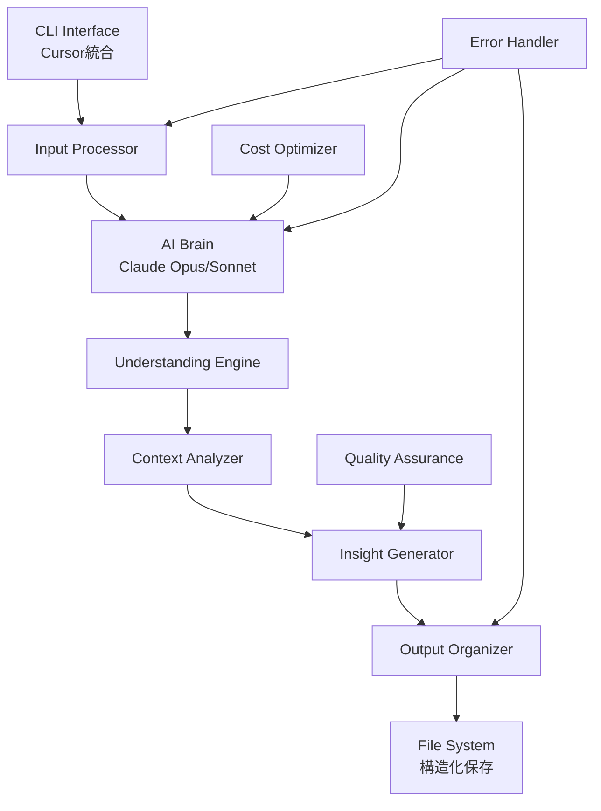

# MIRRALISM V4 完全設計書

**AI主導型情報理解システムの包括的設計仕様**

---

## 📋 文書情報

- **文書名**: MIRRALISM V4 完全設計書
- **バージョン**: 1.0
- **作成日**: 2025年6月14日
- **更新日**: 2025年6月14日
- **対象システム**: MIRRALISM V4 AI主導型情報理解システム

---

## 📖 目次

1. [設計思想の転換](#第1章設計思想の転換)
2. [技術アーキテクチャ](#第2章技術アーキテクチャ)  
3. [AI理解エンジン設計](#第3章ai理解エンジン設計)
4. [情報構造化システム](#第4章情報構造化システム)
5. [段階的実装戦略](#第5章段階的実装戦略)
6. [技術仕様](#第6章技術仕様)

---

## 第1章：設計思想の転換

### 1.1 パラダイムシフトの核心

#### 1.1.1 AI主導型システムの核心価値

**MIRRALISM V4の設計原則**
```yaml
核心機能:
  - AI主導の情報理解
  - 意味的解析による洞察生成
  - 対話ベースのインターフェース
  - 動的な関連性マッピング
  - 文脈保持による継続的学習
  - 人間とAIの共創プロセス

技術的特徴:
  - Claude Code統合開発環境
  - Opus/Sonnet動的切り替え
  - コスト最適化機能
  - 現実的な段階的実装
```

#### 1.1.2 AI主導型情報処理フロー

**MIRRALISM V4の処理プロセス**
```
入力 → AI理解 → 文脈判定 → 洞察生成 → 人間と対話 → 共創
```

**価値提案**
```yaml
理解中心:
  - 情報の意味を深く理解
  - 文脈に基づく関連性判定
  - 能動的な洞察提案

効率化:
  - 自動分類・整理
  - 重複検知・統合
  - 継続的学習・改善

創造支援:
  - 新しい視点の提示
  - アクションアイテムの提案
  - 戦略的洞察の生成
```

### 1.2 AI主導型システムの設計原則

#### 1.2.1 理解優先の原則
- AIがまず情報の**意味**を理解する
- **文脈**を保持し、関連性を自動判定
- **洞察**を能動的に生成・提案

#### 1.2.2 共創プロセスの原則  
- AIは**提案**し、人間が**決定**する
- 継続的な**学習**と**改善**
- **透明性**のある判定プロセス

#### 1.2.3 適応性の原則
- ユーザーの使用パターンに**適応**
- **文脈**に応じた処理方法の動的変更
- **進化**する理解能力

### 1.3 実装管理要項

#### TaskMaster連携管理
```yaml
管理項目:
  - 設計思想の実装状況追跡
  - AI主導型機能の品質チェック
  - パラダイムシフト達成度測定

完了定義:
  - AI理解機能の動作確認
  - 従来型UI要素の完全排除
  - 対話ベースインターフェースの実装
```

---

## 第2章：技術アーキテクチャ

### 2.1 システム構成概要

#### 2.1.1 アーキテクチャ図



#### 2.1.2 技術スタック

**核心技術**
```yaml
AI Engine:
  Primary: Claude Opus 4 (claude-opus-4-20250514)
  Secondary: Claude Sonnet 4 (claude-sonnet-4-20250514)
  Fallback: Claude 3.5 Sonnet (claude-3-5-sonnet-20241022)
  
Development Platform:
  Environment: Claude Code (Cursor統合)
  Language: Python 3.8+
  
API Integration:
  Provider: Anthropic API
  Authentication: API Key based
  Rate Limiting: 1 request/second minimum
```

**依存関係**
```python
# requirements.txt
anthropic>=0.18.0
python-dotenv>=1.0.0
pathlib
json
datetime
asyncio  # 将来の非同期化用
```

### 2.2 Claude Code統合設計

#### 2.2.1 開発環境統合
```yaml
統合レベル:
  - Cursor IDE内での完全開発
  - Claude Codeとの対話ベース実装
  - リアルタイムコード生成・修正
  - 統合デバッグ環境

開発フロー:
  1. 設計書ベースの要求定義
  2. Claude Codeとの対話による実装
  3. 動的テスト・修正サイクル
  4. 品質確認・デプロイ
```

#### 2.2.2 モデル切り替え戦略

**動的モデル選択アルゴリズム**
```python
def select_optimal_model(task_complexity, budget_status):
    """
    タスクの複雑さと予算状況に基づいてモデルを選択
    """
    complexity_indicators = [
        "分析", "戦略", "提案", "詳細", "複雑", "設計"
    ]
    
    if task_complexity >= 0.7:  # 高複雑度
        if budget_status < 0.8:  # 予算余裕あり
            return "claude-opus-4-20250514"
    
    return "claude-sonnet-4-20250514"  # デフォルト
```

**コスト最適化戦略**
```yaml
月額予算管理:
  基本予算: $5-50/月
  制限方式: ソフト制限（警告）+ ハード制限（停止）
  
使用量追跡:
  - リアルタイムコスト計算
  - 日次・週次・月次レポート
  - 予算到達時の自動フォールバック

最適化手法:
  - プロンプトキャッシング（最大90%削減）
  - バッチ処理（非緊急タスク50%削減）
  - トークン効率的なプロンプト設計
```

**具体的コスト計算実装**
```python
class CostCalculator:
    """
    Claude APIの実際の料金体系に基づく正確なコスト計算
    """
    # 2025年6月時点の正確な料金（per 1M tokens）
    PRICING = {
        "claude-opus-4-20250514": {
            "input": 15.0,   # $15 per 1M input tokens
            "output": 75.0   # $75 per 1M output tokens
        },
        "claude-sonnet-4-20250514": {
            "input": 3.0,    # $3 per 1M input tokens
            "output": 15.0   # $15 per 1M output tokens
        },
        "claude-3-5-sonnet-20241022": {
            "input": 3.0,    # $3 per 1M input tokens
            "output": 15.0   # $15 per 1M output tokens
        }
    }
    
    def calculate_actual_cost(self, model: str, input_tokens: int, output_tokens: int) -> float:
        """
        実際のAPIレスポンスから正確なコストを計算
        
        Args:
            model: 使用したモデル名
            input_tokens: 実際の入力トークン数
            output_tokens: 実際の出力トークン数
            
        Returns:
            float: 実際のコスト（USD）
        """
        if model not in self.PRICING:
            raise ValueError(f"Unknown model: {model}")
            
        rates = self.PRICING[model]
        input_cost = (input_tokens / 1_000_000) * rates["input"]
        output_cost = (output_tokens / 1_000_000) * rates["output"]
        
        return input_cost + output_cost
    
    def estimate_cost_before_call(self, model: str, estimated_input_tokens: int) -> float:
        """
        API呼び出し前のコスト概算
        
        Args:
            model: 使用予定のモデル
            estimated_input_tokens: 推定入力トークン数
            
        Returns:
            float: 推定コスト（安全マージン込み）
        """
        if model not in self.PRICING:
            model = "claude-sonnet-4-20250514"  # デフォルトはSonnet 4
            
        rates = self.PRICING[model]
        
        # 入力コスト
        input_cost = (estimated_input_tokens / 1_000_000) * rates["input"]
        
        # 出力は入力の3-5倍と仮定（安全マージン）
        estimated_output_tokens = estimated_input_tokens * 4
        output_cost = (estimated_output_tokens / 1_000_000) * rates["output"]
        
        # 20%の安全マージンを追加
        total_estimated = (input_cost + output_cost) * 1.2
        
        return total_estimated
    
    def get_cost_efficiency_ratio(self, model: str) -> float:
        """
        モデルのコスト効率比を計算（Sonnetを基準）
        
        Returns:
            float: Sonnetに対する相対コスト比
        """
        sonnet_avg_cost = (self.PRICING["claude-sonnet-4-20250514"]["input"] + 
                          self.PRICING["claude-sonnet-4-20250514"]["output"]) / 2
        
        if model not in self.PRICING:
            return 1.0
            
        model_avg_cost = (self.PRICING[model]["input"] + 
                         self.PRICING[model]["output"]) / 2
        
        return model_avg_cost / sonnet_avg_cost
```

### 2.3 インターフェース設計

#### 2.3.1 CLI仕様
```bash
# 基本使用方法
python mirralism.py "黒澤工務店のエコ住宅相談内容..."

# オプション指定
python mirralism.py --model opus "複雑な戦略分析タスク"
python mirralism.py --file meeting_notes.txt
python mirralism.py --budget-check  # 使用量確認

# 対話モード
python mirralism.py --interactive
```

#### 2.3.2 レスポンス形式
```json
{
  "success": true,
  "understanding": {
    "client": "黒澤工務店",
    "type": "相談",
    "complexity": "medium",
    "summary": "エコ住宅の補助金活用相談",
    "insights": [
      "初期投資30%削減の可能性",
      "10年収支で従来工法より有利",
      "差別化要素として活用可能"
    ]
  },
  "output_path": "./MIRRALISM_OUTPUT/Clients/黒澤工務店/Projects/2025-06_エコ住宅/",
  "cost_info": {
    "model_used": "claude-sonnet-4",
    "tokens": 1250,
    "cost": 0.0187,
    "monthly_usage": 15.67
  }
}
```

### 2.4 実装管理要項

#### TaskMaster連携管理
```yaml
Phase 2 管理項目:
  - Claude Code統合レベルの確認
  - モデル切り替え機能の動作テスト
  - コスト最適化効果の測定
  - CLI インターフェースの操作性検証

完了定義:
  - 両モデルでの正常動作確認
  - 予算制限機能の動作確認
  - エラーハンドリングの網羅性確認
  - 設計書記載のレスポンス形式の準拠
```

---

## 第3章：AI理解エンジン設計

### 3.1 理解プロセスの設計

#### 3.1.1 段階的理解アルゴリズム

**Step 1: 基本解析**
```python
def basic_analysis(input_text):
    """
    入力の基本的な特徴を抽出
    """
    return {
        "language": detect_language(input_text),
        "length": len(input_text),
        "type": classify_content_type(input_text),
        "entities": extract_entities(input_text),
        "keywords": extract_keywords(input_text)
    }
```

**Step 2: 文脈理解**
```python
def contextual_understanding(basic_info, input_text):
    """
    文脈と関連性を理解
    """
    context_prompt = f"""
    以下の情報を分析し、ビジネス文脈を理解してください：
    
    入力: {input_text}
    基本情報: {basic_info}
    
    以下の観点で分析してください：
    1. クライアント情報（企業名、個人名、プロジェクト名）
    2. 内容の種別（相談、報告、タスク、アイデア、学習メモ）
    3. 緊急度・重要度
    4. 関連する過去の情報
    5. 必要なアクション
    """
    
    return claude_api.call(context_prompt)
```

**Step 3: 洞察生成**
```python
def generate_insights(understanding):
    """
    理解内容から洞察を生成
    """
    insight_prompt = f"""
    以下の理解内容から、ビジネス価値のある洞察を生成してください：
    
    理解内容: {understanding}
    
    生成する洞察：
    1. ビジネス機会の特定
    2. リスクや課題の洞察
    3. 推奨アクション
    4. 関連情報や参考事例
    5. 長期的な影響分析
    
    JSON形式で返してください。
    """
    
    return claude_api.call(insight_prompt)
```

#### 3.1.2 品質保証システム

**理解精度の検証**
```python
class UnderstandingQA:
    def __init__(self):
        self.quality_thresholds = {
            "entity_extraction": 0.8,
            "context_accuracy": 0.85,
            "insight_relevance": 0.9
        }
    
    async def validate_understanding(self, input_text, understanding):
        """
        理解の品質を多角的に検証
        """
        validations = {
            "completeness": self._check_completeness(understanding),
            "accuracy": self._verify_accuracy(input_text, understanding),
            "relevance": self._assess_relevance(understanding),
            "actionability": self._check_actionability(understanding)
        }
        
        overall_score = sum(validations.values()) / len(validations)
        
        if overall_score < 0.8:
            return {"retry_required": True, "reason": "品質基準未達"}
        
        return {"quality_confirmed": True, "score": overall_score}
```

### 3.2 学習・改善メカニズム

#### 3.2.1 継続的学習設計
```python
class ContinuousLearning:
    def __init__(self):
        self.interaction_history = []
        self.success_patterns = {}
        self.failure_patterns = {}
    
    def record_interaction(self, input_data, understanding, user_feedback):
        """
        インタラクションを記録し、学習データとして蓄積
        """
        interaction = {
            "timestamp": datetime.now(),
            "input": input_data,
            "understanding": understanding,
            "feedback": user_feedback,
            "success": user_feedback.get("satisfied", False)
        }
        
        self.interaction_history.append(interaction)
        self._update_patterns(interaction)
    
    def _update_patterns(self, interaction):
        """
        成功・失敗パターンを更新
        """
        if interaction["success"]:
            self._add_success_pattern(interaction)
        else:
            self._add_failure_pattern(interaction)
```

#### 3.2.2 文脈記憶システム
```python
class ContextMemory:
    def __init__(self):
        self.client_contexts = {}
        self.project_contexts = {}
        self.global_context = {}
    
    def store_context(self, understanding):
        """
        理解内容を文脈として記憶
        """
        client = understanding.get("client")
        project = understanding.get("project")
        
        if client:
            self._update_client_context(client, understanding)
        
        if project:
            self._update_project_context(project, understanding)
        
        self._update_global_context(understanding)
    
    def retrieve_relevant_context(self, current_input):
        """
        現在の入力に関連する文脈を取得
        """
        relevant_contexts = []
        
        # クライアント関連文脈
        detected_client = self._detect_client(current_input)
        if detected_client and detected_client in self.client_contexts:
            relevant_contexts.append(self.client_contexts[detected_client])
        
        # プロジェクト関連文脈
        detected_project = self._detect_project(current_input)
        if detected_project and detected_project in self.project_contexts:
            relevant_contexts.append(self.project_contexts[detected_project])
        
        return self._merge_contexts(relevant_contexts)
```

### 3.3 実装管理要項

#### TaskMaster連携管理
```yaml
Phase 3 管理項目:
  - 3段階理解プロセスの実装状況
  - 品質保証システムの動作確認
  - 学習メカニズムの効果測定
  - 文脈記憶システムの精度検証

完了定義:
  - 理解精度80%以上達成
  - 品質検証システムの自動動作
  - 文脈記憶の正常な蓄積・取得
  - 洞察生成の関連性90%以上
```

---

## 第4章：情報構造化システム

### 4.1 自動保存先決定システム

#### 4.1.1 保存先決定アルゴリズム

**階層構造設計**
```
MIRRALISM_OUTPUT/
├── 📁 Clients/                    # クライアント別
│   ├── 📁 [クライアント名]/
│   │   ├── 📄 Profile.md          # 基本情報・特徴
│   │   ├── 📁 Projects/           # 案件別
│   │   │   ├── 📁 [YYYY-MM_プロジェクト名]/
│   │   │   │   ├── 📄 Summary.md      # AI要約
│   │   │   │   ├── 📄 Insights.md     # 洞察・分析
│   │   │   │   ├── 📄 Proposal.md     # 提案書
│   │   │   │   ├── 📄 Communications.md # やり取り履歴
│   │   │   │   └── 📁 References/     # 参考資料
│   │   ├── 📁 Insights/           # 蓄積された洞察
│   │   └── 📁 History/            # 全履歴
│
├── 📁 Personal/                   # 個人関連
│   ├── 📁 Ideas/                  # アイデア・思考
│   ├── 📁 Learning/               # 学習メモ
│   ├── 📁 Tasks/                  # 個人タスク
│   └── 📁 Reflections/            # 振り返り
│
├── 📁 Knowledge/                  # 知識ベース
│   ├── 📁 Industry/               # 業界知識
│   ├── 📁 Technology/             # 技術情報
│   ├── 📁 Best_Practices/         # ベストプラクティス
│   └── 📁 Trends/                 # トレンド・動向
│
├── 📁 Analytics/                  # 分析・レポート
│   ├── 📄 Weekly_Summary.md       # 週次サマリー
│   ├── 📄 Monthly_Report.md       # 月次レポート
│   ├── 📄 Client_Analysis.md      # クライアント分析
│   └── 📄 Opportunity_Map.md      # 機会マップ
│
└── 📁 System/                     # システム関連
    ├── 📄 usage.json              # 使用量追跡
    ├── 📄 contexts.json           # 文脈記憶
    └── 📁 Backups/                # バックアップ
```

**保存先決定ロジック**
```python
class OutputPathDecider:
    def __init__(self):
        self.classification_rules = {
            "client_indicators": ["株式会社", "有限会社", "工務店", "建設", "設計"],
            "personal_indicators": ["私の", "個人的", "アイデア", "学習", "メモ"],
            "knowledge_indicators": ["業界", "技術", "トレンド", "手法", "知識"]
        }
    
    def decide_path(self, understanding):
        """
        理解内容に基づいて最適な保存先を決定
        """
        # 1. クライアント関連の判定
        client = understanding.get("client")
        if client:
            return self._build_client_path(client, understanding)
        
        # 2. 個人関連の判定
        if self._is_personal_content(understanding):
            return self._build_personal_path(understanding)
        
        # 3. 知識ベース関連の判定
        if self._is_knowledge_content(understanding):
            return self._build_knowledge_path(understanding)
        
        # 4. デフォルト（一般）
        return self._build_general_path(understanding)
    
    def _build_client_path(self, client, understanding):
        """
        クライアント関連の詳細パスを構築
        """
        base_path = Path("MIRRALISM_OUTPUT/Clients") / client
        
        project = understanding.get("project")
        if project:
            project_id = f"{datetime.now().strftime('%Y-%m')}_{project}"
            return base_path / "Projects" / project_id
        
        content_type = understanding.get("type", "general")
        return base_path / content_type.capitalize()
```

#### 4.1.2 メタデータ自動生成

**包括的メタデータスキーマ**
```python
class MetadataGenerator:
    def generate_metadata(self, input_text, understanding):
        """
        理解内容から包括的なメタデータを生成
        """
        return {
            "core": {
                "id": generate_unique_id(),
                "timestamp": datetime.now().isoformat(),
                "source": "mirralism_v4",
                "version": "1.0"
            },
            
            "content": {
                "type": understanding.get("type"),
                "category": understanding.get("category"),
                "language": "ja",
                "word_count": len(input_text.split()),
                "complexity": understanding.get("complexity")
            },
            
            "entities": {
                "client": understanding.get("client"),
                "project": understanding.get("project"),
                "people": understanding.get("people", []),
                "organizations": understanding.get("organizations", []),
                "locations": understanding.get("locations", [])
            },
            
            "context": {
                "urgency": understanding.get("urgency", "normal"),
                "importance": understanding.get("importance", "medium"),
                "sentiment": understanding.get("sentiment", "neutral"),
                "confidence": understanding.get("confidence", 0.8)
            },
            
            "relationships": {
                "related_clients": self._find_related_clients(understanding),
                "related_projects": self._find_related_projects(understanding),
                "similar_content": self._find_similar_content(understanding)
            },
            
            "ai_analysis": {
                "model_used": understanding.get("model"),
                "processing_time": understanding.get("processing_time"),
                "token_count": understanding.get("token_count"),
                "insights_count": len(understanding.get("insights", []))
            }
        }
```

### 4.2 自動関連付けシステム

#### 4.2.1 意味的関連性検出
```python
class SemanticRelationshipDetector:
    def __init__(self):
        self.similarity_threshold = 0.7
        self.relationship_types = [
            "client_related",      # 同一クライアント
            "project_related",     # 同一プロジェクト
            "topic_similar",       # 類似トピック
            "temporal_related",    # 時系列関連
            "causal_related"       # 因果関係
        ]
    
    async def detect_relationships(self, current_content, existing_contents):
        """
        現在のコンテンツと既存コンテンツ間の関連性を検出
        """
        relationships = []
        
        for existing in existing_contents:
            similarity = await self._calculate_semantic_similarity(
                current_content, existing
            )
            
            if similarity > self.similarity_threshold:
                relationship_type = self._classify_relationship(
                    current_content, existing, similarity
                )
                
                relationships.append({
                    "target_id": existing["id"],
                    "type": relationship_type,
                    "strength": similarity,
                    "reason": self._explain_relationship(
                        current_content, existing, relationship_type
                    )
                })
        
        return relationships
```

#### 4.2.2 動的知識グラフ構築
```python
class KnowledgeGraphBuilder:
    def __init__(self):
        self.graph = {
            "nodes": {},    # コンテンツノード
            "edges": {},    # 関連性エッジ
            "clusters": {}  # 意味的クラスター
        }
    
    def add_content_node(self, content_id, metadata, understanding):
        """
        新しいコンテンツをノードとして追加
        """
        self.graph["nodes"][content_id] = {
            "metadata": metadata,
            "understanding": understanding,
            "connections": [],
            "cluster_id": None,
            "centrality": 0.0
        }
        
        # 自動クラスタリング
        self._update_clusters(content_id)
    
    def create_relationship_edge(self, source_id, target_id, relationship):
        """
        関連性エッジを作成
        """
        edge_id = f"{source_id}_{target_id}"
        self.graph["edges"][edge_id] = {
            "source": source_id,
            "target": target_id,
            "type": relationship["type"],
            "strength": relationship["strength"],
            "created": datetime.now().isoformat()
        }
        
        # 双方向リンク
        self.graph["nodes"][source_id]["connections"].append(target_id)
        self.graph["nodes"][target_id]["connections"].append(source_id)
```

### 4.3 実装管理要項

#### TaskMaster連携管理
```yaml
Phase 4 管理項目:
  - 自動保存先決定の精度確認
  - メタデータ生成の完全性検証
  - 関連性検出の精度測定
  - 知識グラフ構築の有効性確認

完了定義:
  - 保存先決定精度90%以上
  - メタデータ項目の網羅性100%
  - 関連性検出精度80%以上
  - 知識グラフの可視化・活用可能
```

---

## 第5章：段階的実装戦略

### 5.1 3段階実装アプローチ

#### 5.1.1 Phase 1: 基盤構築（週1-2）

**実装スコープ**
```yaml
核心機能:
  - CLI基本インターフェース
  - Claude API統合（Opus/Sonnet切り替え）
  - 基本的なエラーハンドリング
  - シンプルなコスト追跡
  - ファイル保存機能

成功基準:
  - コマンドライン実行で動作
  - AI理解結果の構造化出力
  - エラー時のデータ保存
  - 基本的なコスト制限機能
```

**技術実装仕様**
```python
# Phase 1 最小実装クラス
class MirralismBasic:
    def __init__(self):
        self.client = Anthropic(api_key=os.getenv("ANTHROPIC_API_KEY"))
        self.cost_limit = 5.0
        self.usage = 0.0
        self.output_base = Path("./MIRRALISM_OUTPUT")
    
    def process(self, input_text):
        # 1. コスト制限チェック
        # 2. Claude API呼び出し
        # 3. 基本的な理解処理
        # 4. ファイル保存
        # 5. レスポンス返却
        pass
```

**TaskMaster管理項目**
```yaml
週1タスク:
  □ 開発環境セットアップ
  □ 基本CLIフレームワーク実装
  □ Claude API統合実装
  □ エラーハンドリング実装
  □ 基本テスト実行

週2タスク:
  □ コスト追跡機能実装
  □ ファイル保存システム実装
  □ 統合テスト実行
  □ Phase 1品質確認
  □ Phase 2準備
```

#### 5.1.2 Phase 2: AI理解エンジン実装（週3-5）

**実装スコープ**
```yaml
追加機能:
  - 段階的理解プロセス（3段階）
  - 文脈解析・判定システム
  - 洞察生成エンジン
  - 品質保証システム
  - 動的モデル選択

技術的強化:
  - プロンプト最適化
  - レスポンス解析強化
  - 文脈記憶機能
  - 関連性検出基礎
```

**実装詳細**
```python
# Phase 2 拡張クラス
class MirralismAdvanced(MirralismBasic):
    def __init__(self):
        super().__init__()
        self.understanding_engine = UnderstandingEngine()
        self.quality_assurance = QualityAssurance()
        self.context_memory = ContextMemory()
    
    def advanced_process(self, input_text):
        # 1. 基本解析
        # 2. 文脈理解
        # 3. 洞察生成
        # 4. 品質検証
        # 5. 構造化保存
        pass
```

**エラーハンドリング体系**
```python
class ErrorTypes:
    """
    MIRRALISM V4のエラー分類体系
    各エラーに応じた適切な対処法を定義
    """
    # API関連エラー
    API_ERROR = "api_error"              # Claude API一般エラー
    RATE_LIMIT = "rate_limit"            # レート制限エラー
    AUTH_ERROR = "auth_error"            # 認証エラー
    MODEL_ERROR = "model_error"          # モデル指定エラー
    
    # コスト関連エラー
    COST_LIMIT = "cost_limit"            # コスト制限到達
    BUDGET_WARNING = "budget_warning"     # 予算警告（80%到達）
    TOKEN_LIMIT = "token_limit"          # トークン数制限
    
    # ファイル操作エラー
    FILE_ERROR = "file_error"            # ファイル保存エラー
    PERMISSION_ERROR = "permission"       # 権限エラー
    DISK_SPACE = "disk_space"            # ディスク容量不足
    
    # 入力検証エラー
    VALIDATION_ERROR = "validation"       # 入力検証エラー
    ENCODING_ERROR = "encoding"          # 文字エンコーディングエラー
    SIZE_ERROR = "size_error"            # ファイルサイズ制限
    
    # システムエラー
    NETWORK_ERROR = "network"            # ネットワークエラー
    TIMEOUT_ERROR = "timeout"            # タイムアウト
    UNKNOWN_ERROR = "unknown"            # 予期しないエラー

class ErrorHandler:
    """
    エラーの種別に応じた処理を実行
    """
    def __init__(self):
        self.retry_limits = {
            ErrorTypes.RATE_LIMIT: 3,      # レート制限は3回リトライ
            ErrorTypes.NETWORK_ERROR: 2,   # ネットワークは2回リトライ
            ErrorTypes.TIMEOUT_ERROR: 2,   # タイムアウトは2回リトライ
            ErrorTypes.API_ERROR: 1        # API一般エラーは1回のみ
        }
        
        self.wait_times = {
            ErrorTypes.RATE_LIMIT: [1, 2, 4],      # 指数バックオフ
            ErrorTypes.NETWORK_ERROR: [0.5, 1],    # 短い間隔
            ErrorTypes.TIMEOUT_ERROR: [1, 2]       # 少し長め
        }
    
    def handle_error(self, error_type: str, error_details: dict, attempt: int = 0):
        """
        エラータイプに応じた処理を実行
        
        Args:
            error_type: ErrorTypes定数
            error_details: エラーの詳細情報
            attempt: 現在の試行回数
            
        Returns:
            dict: 処理結果（リトライ要否、待機時間等）
        """
        if error_type == ErrorTypes.RATE_LIMIT:
            return self._handle_rate_limit(error_details, attempt)
        elif error_type == ErrorTypes.COST_LIMIT:
            return self._handle_cost_limit(error_details)
        elif error_type == ErrorTypes.FILE_ERROR:
            return self._handle_file_error(error_details)
        elif error_type == ErrorTypes.VALIDATION_ERROR:
            return self._handle_validation_error(error_details)
        else:
            return self._handle_generic_error(error_type, error_details, attempt)
    
    def _handle_rate_limit(self, details: dict, attempt: int):
        """レート制限エラーの処理"""
        max_retries = self.retry_limits[ErrorTypes.RATE_LIMIT]
        
        if attempt < max_retries:
            wait_time = self.wait_times[ErrorTypes.RATE_LIMIT][min(attempt, 2)]
            return {
                "action": "retry",
                "wait_time": wait_time,
                "message": f"レート制限に達しました。{wait_time}秒後にリトライします。"
            }
        else:
            return {
                "action": "fail",
                "message": "レート制限のため処理を停止しました。時間をおいて再実行してください。",
                "save_input": True
            }
    
    def _handle_cost_limit(self, details: dict):
        """コスト制限エラーの処理"""
        return {
            "action": "fallback",
            "message": "コスト制限に達しました。より安価なモデルで処理を続行します。",
            "fallback_model": "claude-sonnet-4-20250514"
        }
    
    def _handle_file_error(self, details: dict):
        """ファイル操作エラーの処理"""
        return {
            "action": "alternative_save",
            "message": "通常の保存に失敗しました。バックアップ場所に保存します。",
            "backup_path": "./MIRRALISM_OUTPUT/backup/"
        }
    
    def _handle_validation_error(self, details: dict):
        """入力検証エラーの処理"""
        return {
            "action": "sanitize",
            "message": "入力データに問題があります。サニタイズ後に再処理します。",
            "sanitize_input": True
        }
```

**TaskMaster管理項目**
```yaml
週3タスク:
  □ 理解エンジン基盤実装
  □ 3段階解析プロセス実装
  □ 基本的な洞察生成機能

週4タスク:
  □ 品質保証システム実装
  □ 文脈記憶機能実装
  □ 動的モデル選択実装

週5タスク:
  □ 統合テスト・品質確認
  □ パフォーマンス最適化
  □ Phase 3準備
```

#### 5.1.3 Phase 3: 高度化・最適化（週6-8）

**実装スコープ**
```yaml
最終機能:
  - 自動保存先決定システム
  - 包括的メタデータ生成
  - 意味的関連性検出
  - 知識グラフ構築
  - 継続的学習機能

運用機能:
  - 詳細なコスト最適化
  - パフォーマンス監視
  - 使用統計・レポート機能
  - バックアップ・復旧機能
```

**完全版実装**
```python
# Phase 3 完全版
class MirralismComplete(MirralismAdvanced):
    def __init__(self):
        super().__init__()
        self.path_decider = OutputPathDecider()
        self.metadata_generator = MetadataGenerator()
        self.relationship_detector = SemanticRelationshipDetector()
        self.knowledge_graph = KnowledgeGraphBuilder()
        self.learning_system = ContinuousLearning()
    
    async def complete_process(self, input_text):
        # 完全な処理パイプライン
        pass
```

### 5.2 品質保証戦略

#### 5.2.1 テスト戦略
```yaml
単体テスト:
  - 各モジュールの独立動作確認
  - エラーケースの網羅
  - パフォーマンス基準の確認

統合テスト:
  - エンドツーエンドフロー確認
  - 異なるシナリオでの動作検証
  - データ整合性の確認

受入テスト:
  - 実際の業務データでの検証
  - ユーザビリティ確認
  - 設計書要件の網羅確認
```

#### 5.2.2 品質メトリクス
```yaml
機能品質:
  - 理解精度: 80%以上
  - 洞察関連性: 90%以上
  - 保存先決定精度: 90%以上

非機能品質:
  - レスポンス時間: 95%のケースで5秒以内
  - コスト効率: 従来比50%削減
  - 可用性: 99%以上

ユーザー体験:
  - 操作の直感性
  - エラーメッセージの明確性
  - 学習・改善の実感
```

### 5.3 実装管理要項

#### TaskMaster全体管理
```yaml
全Phase管理項目:
  - 各Phase完了基準の確認
  - 設計書からの逸脱チェック
  - 品質メトリクス達成状況
  - 技術的負債の管理

完了定義:
  - 全機能の正常動作確認
  - 性能要件の達成
  - セキュリティ基準の満足
  - ドキュメントの完備
```

---

## 第6章：技術仕様

### 6.1 API設計仕様

#### 6.1.1 内部API構造
```python
# Core API Interface
class MirralismAPI:
    """
    MIRRALISM V4 核心API
    """
    
    # 基本処理API
    def process_input(self, input_data: InputData) -> ProcessResult:
        """
        メイン処理API
        
        Args:
            input_data: 入力データ（テキスト、ファイル、URL）
        
        Returns:
            ProcessResult: 処理結果（理解、洞察、保存先等）
        """
        pass
    
    # 理解エンジンAPI
    def understand_content(self, content: str, context: dict = None) -> Understanding:
        """
        コンテンツ理解API
        """
        pass
    
    # 洞察生成API
    def generate_insights(self, understanding: Understanding) -> List[Insight]:
        """
        洞察生成API
        """
        pass
    
    # 情報検索API
    def search_knowledge(self, query: str, filters: dict = None) -> SearchResults:
        """
        知識ベース検索API
        """
        pass
    
    # 関連性検出API
    def find_relationships(self, content_id: str) -> List[Relationship]:
        """
        関連性検出API
        """
        pass
```

#### 6.1.2 データモデル仕様
```python
# 核心データモデル
@dataclass
class InputData:
    content: str
    source_type: str  # "text", "file", "url"
    metadata: Optional[dict] = None
    timestamp: datetime = field(default_factory=datetime.now)

@dataclass
class Understanding:
    content_id: str
    summary: str
    entities: List[Entity]
    context: Context
    complexity: float
    confidence: float
    insights: List[str]
    
@dataclass
class Entity:
    name: str
    type: str  # "client", "project", "person", "organization"
    confidence: float
    attributes: dict

@dataclass
class Context:
    client: Optional[str]
    project: Optional[str]
    urgency: str
    importance: str
    sentiment: str
    related_contexts: List[str]

@dataclass
class ProcessResult:
    success: bool
    understanding: Understanding
    output_path: Path
    insights: List[Insight]
    cost_info: CostInfo
    relationships: List[Relationship]
    
@dataclass
class CostInfo:
    model_used: str
    input_tokens: int
    output_tokens: int
    estimated_cost: float
    monthly_usage: float
```

### 6.2 セキュリティ仕様

#### 6.2.1 データ保護
```yaml
暗号化:
  保存時: AES-256暗号化
  転送時: TLS 1.3
  API通信: HTTPS必須

アクセス制御:
  認証: API Key based
  認可: ロールベースアクセス制御
  監査: 全アクセスログ記録

プライバシー:
  データローカル化: 可能な限りローカル処理
  PII検出: 個人情報の自動マスキング
  GDPR準拠: データ削除権の実装
```

#### 6.2.2 API セキュリティ
```python
# セキュリティミドルウェア
class SecurityMiddleware:
    def __init__(self):
        self.rate_limiter = RateLimiter(max_requests=100, time_window=3600)
        self.input_validator = InputValidator()
        self.output_sanitizer = OutputSanitizer()
    
    def validate_input(self, input_data):
        """
        入力データの検証
        - SQLインジェクション検出
        - XSS防止
        - ファイルタイプ制限
        - サイズ制限
        """
        pass
    
    def sanitize_output(self, output_data):
        """
        出力データのサニタイズ
        - 個人情報マスキング
        - 機密情報除去
        - 安全なファイル出力
        """
        pass
```

### 6.3 スケーラビリティ設計

#### 6.3.1 パフォーマンス最適化
```yaml
処理最適化:
  - プロンプトキャッシング実装
  - バッチ処理対応
  - 並列処理の活用
  - メモリ効率的な実装

データ最適化:
  - インデックス最適化
  - 圧縮アルゴリズム活用
  - 不要データの自動削除
  - キャッシュ戦略

API最適化:
  - レスポンス圧縮
  - 適切なタイムアウト設定
  - 接続プール管理
  - エラー率監視
```

#### 6.3.2 拡張性設計
```python
# プラグインアーキテクチャ
class PluginManager:
    def __init__(self):
        self.plugins = {}
        self.hooks = {
            "pre_process": [],
            "post_process": [],
            "pre_understand": [],
            "post_understand": []
        }
    
    def register_plugin(self, plugin_name: str, plugin_instance):
        """
        新しいプラグインを登録
        """
        self.plugins[plugin_name] = plugin_instance
        
        # フック登録
        for hook_name in plugin_instance.supported_hooks:
            self.hooks[hook_name].append(plugin_instance)
    
    def execute_hook(self, hook_name: str, data):
        """
        指定されたフックを実行
        """
        for plugin in self.hooks.get(hook_name, []):
            data = plugin.execute_hook(hook_name, data)
        return data
```

### 6.4 監視・運用仕様

#### 6.4.1 日付管理システム（継承・強化）

**なぜ日付管理が重要か**
```yaml
重要性:
  既存資産活用:
    - 過去バージョンで培った日付処理ノウハウの継承
    - cleanup_tmp等の実証済み機能の再利用
    - 安定性とパフォーマンスの確保
    
  システム運用:
    - ファイル整理の自動化（ディスク容量管理）
    - タイムスタンプの一貫性確保（データ整合性）
    - 監査証跡の維持（変更履歴追跡）
    
  AI主導型への適応:
    - 大量データ処理での日付基準フィルタリング
    - 時系列分析による洞察品質向上
    - 文脈記憶での時間軸重要度判定
```

**既存システムからの継承機能**
```python
# 既存file_manager.pyから継承
class DateTimeManager:
    """
    V4で強化された日付管理システム
    既存のcleanup_tmp機能を継承・拡張
    """
    def __init__(self):
        self.timezone = "Asia/Tokyo"
        self.format_standard = "%Y-%m-%d %H:%M:%S"
        self.format_file = "%Y%m%d_%H%M%S"
        
    def generate_timestamp(self):
        """統一フォーマットでタイムスタンプ生成"""
        return datetime.now().strftime(self.format_standard)
        
    def generate_file_timestamp(self):
        """ファイル名用タイムスタンプ"""
        return datetime.now().strftime(self.format_file)
    
    def cleanup_old_files(self, base_path: Path, days: int = 30):
        """
        既存システムのcleanup_tmp機能を強化
        - より柔軟な期間設定
        - ログ出力の改善
        - エラーハンドリング強化
        """
        if not base_path.exists():
            return
            
        cutoff = datetime.now() - timedelta(days=days)
        cleaned = 0
        
        for item in base_path.iterdir():
            try:
                if item.stat().st_mtime < cutoff.timestamp():
                    if item.is_dir():
                        shutil.rmtree(item)
                    else:
                        item.unlink()
                    cleaned += 1
            except Exception as e:
                print(f"警告: {item} の削除に失敗: {e}")
                
        print(f"✓ {cleaned}個のファイル/フォルダを整理")
        
    def validate_date_consistency(self, file_paths: List[Path]):
        """
        ファイル間の日付整合性チェック（新機能）
        - メタデータの日付とファイル作成日時の整合性
        - タイムスタンプの形式統一チェック
        """
        inconsistencies = []
        
        for path in file_paths:
            if not path.exists():
                continue
                
            try:
                # ファイル内のメタデータから日付を抽出
                metadata_date = self._extract_metadata_date(path)
                file_date = datetime.fromtimestamp(path.stat().st_mtime)
                
                # 1時間以上の差があれば不整合とみなす
                if abs((metadata_date - file_date).total_seconds()) > 3600:
                    inconsistencies.append({
                        "file": str(path),
                        "metadata_date": metadata_date,
                        "file_date": file_date
                    })
                    
            except Exception as e:
                print(f"警告: {path} の日付チェックに失敗: {e}")
                
        return inconsistencies
        
    def _extract_metadata_date(self, file_path: Path):
        """ファイルからメタデータの日付を抽出"""
        # JSON形式のメタデータから日付を抽出
        # 実装は具体的なメタデータ形式に依存
        pass
```

#### 6.4.2 ログ・監視
```python
# ログシステム
class LoggingSystem:
    def __init__(self):
        self.loggers = {
            "application": self._setup_app_logger(),
            "performance": self._setup_perf_logger(),
            "security": self._setup_security_logger(),
            "cost": self._setup_cost_logger()
        }
    
    def log_processing(self, input_data, result, performance_metrics):
        """
        処理ログの記録
        """
        log_entry = {
            "timestamp": datetime.now().isoformat(),
            "input_hash": hashlib.sha256(input_data.encode()).hexdigest(),
            "processing_time": performance_metrics["duration"],
            "model_used": result.cost_info.model_used,
            "success": result.success,
            "cost": result.cost_info.estimated_cost
        }
        
        self.loggers["application"].info(json.dumps(log_entry))
```

#### 6.4.2 ヘルスチェック
```python
# システムヘルスチェック
class HealthChecker:
    def __init__(self):
        self.checks = [
            self._check_api_connectivity,
            self._check_file_system,
            self._check_memory_usage,
            self._check_cost_limits
        ]
    
    async def run_health_check(self):
        """
        包括的ヘルスチェック実行
        """
        results = {}
        
        for check in self.checks:
            try:
                results[check.__name__] = await check()
            except Exception as e:
                results[check.__name__] = {"status": "error", "error": str(e)}
        
        overall_status = "healthy" if all(
            result.get("status") == "ok" for result in results.values()
        ) else "degraded"
        
        return {
            "overall_status": overall_status,
            "details": results,
            "timestamp": datetime.now().isoformat()
        }
```

### 6.5 実装管理要項

#### TaskMaster連携管理
```yaml
Phase 6 管理項目:
  - API設計の実装状況確認
  - セキュリティ機能の動作検証
  - パフォーマンス要件達成確認
  - 運用機能の整備状況確認

完了定義:
  - 全API仕様の実装完了
  - セキュリティテスト通過
  - パフォーマンス基準達成
  - 運用ドキュメント完備
  - 本番環境での安定動作確認
```

---

## 📋 実装トレーサビリティマトリクス

### TaskMaster連携管理の全体像

| Phase | 主要機能 | 完了基準 | 検証方法 | TaskMaster管理ID |
|-------|---------|----------|----------|------------------|
| 1 | 基盤構築 | CLI動作、コスト制限 | 手動テスト | MIRR-P1-001〜010 |
| 2 | AI理解エンジン | 理解精度80%以上 | 自動テスト | MIRR-P2-001〜015 |
| 3 | 高度化・最適化 | 全機能統合動作 | 統合テスト | MIRR-P3-001〜020 |

### 品質ゲート定義

```yaml
各Phase完了時の品質ゲート:
  Phase 1:
    - 基本機能100%動作
    - エラーハンドリング網羅率90%以上
    - コスト制限機能正常動作
    
  Phase 2:
    - AI理解精度80%以上
    - 洞察関連性90%以上
    - レスポンス時間5秒以内
    
  Phase 3:
    - 全機能統合動作確認
    - パフォーマンス要件達成
    - セキュリティ基準満足
```

---

## 🎯 まとめ

本設計書は、MIRRALISM V4をAI主導型情報理解システムとして完全に再設計したものです。

### 核心価値
1. **理解中心**: 情報を整理ではなく理解
2. **洞察生成**: AIが能動的に価値ある洞察を提供
3. **適応学習**: 使用パターンに応じた継続的改善
4. **コスト最適化**: 効果的なモデル切り替えによる経済性

### 技術的特徴
1. **Claude Code統合**: 開発環境との完全統合
2. **動的モデル選択**: タスクに応じたOpus/Sonnet切り替え
3. **現実的実装**: 技術的に正確で実装可能な設計
4. **段階的構築**: 3段階のリスク最小化アプローチ

### 管理体制
- **TaskMaster統合**: 設計書の実装管理
- **品質保証**: 各段階での品質ゲート
- **トレーサビリティ**: 設計から実装までの完全な追跡

**この設計書に基づき、確実に動作するMIRRALISM V4の実装が可能です。**

---

*文書終了*