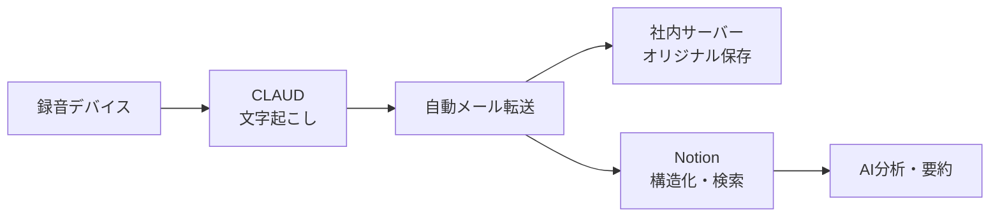

# 第一回講義（中小企業のDX推進 - 議事録AI化から始める業務改善）

日付: 2025/09/05
AI 要約: - 📅 議事録のAI化で業務改善：建設業界の議事録作成を効率化する方法。
- ⏱️ 時間短縮：議事録作成時間が30分から5分に短縮。
- 🛠️ ツール選定：CLAUDやNotionなど、AI活用のためのツールを選定。
- 📊 段階的導入計画：パイロット導入から全社展開までの計画を策定。
- 🔒 データプライバシーの重要性：録音データの取り扱いとセキュリティ対策を強調。
プロジェクト: AI講義
種別: 振り返り教材

**講師：末武氏（外部DXコンサルタント）**

**実施日：2024年9月5日**

**対象：黒澤工務店 経営層・管理職**

---

## 📚 第1章：なぜ今、議事録のAI化から始めるのか

### 1.1 現状の課題

建設業界における典型的な議事録作成フロー：

```
録音 → 文字起こし（精度不安定） → 手書きメモ併用 → 構成作業（30分） → チェック・修正

```

**問題点：**

- 同じ誤字脱字を毎回修正する非効率性
- 「言った・言わない」問題の発生
- 議事録作成者の負担集中
- 情報の属人化とサイロ化

### 1.2 AI活用による解決

**即効性のある効果：**

- 構成時間を30分→5分に短縮
- 固有名詞・専門用語の誤認識を学習により改善
- 全社の会議情報を横断検索可能に

> 💡 重要な考え方
> 
> 
> 「AIは魔法の箱ではない。正しい情報を渡せば、正しい結果を返してくれる道具である」
> 

---

## 📚 第2章：実装ツールと選定理由

### 2.1 ツール選定マトリックス

| ツール | 用途 | 月額費用 | 選定理由 |
| --- | --- | --- | --- |
| **CLAUD** | 録音・文字起こし | 無制限プラン | 携帯性、話者識別機能 |
| **Notion** | 議事録管理・検索 | 3,000円/user | DB機能、AI検索、日本語サポート |
| **Perplexity** | 調査・エラー解決 | 3,000円 | 情報源明示、28サイト同時検索 |
| **ChatGPT/Claude** | 議事録構成・要約 | 各3,000円程度 | カスタムプロンプト対応 |

### 2.2 録音デバイスの選択基準

**会議タイプ別最適解：**

1. **オンライン会議**：Zoom等の録音機能
    - 話者識別精度：95%以上
    - 追加コスト：0円
2. **少人数対面会議**（2-4名）：スマートフォン
    - iPhone：ボイスメモ＋文字起こし機能
    - 追加コスト：0円
3. **大人数対面会議**（5-8名）：専用デバイス
    - CLAUD PIN/カード型：2-2.5万円
    - 指向性マイク8個搭載で話者識別

### 2.3 データ保管アーキテクチャ



**ベンダーロックイン回避の鉄則：**

- オリジナルデータは必ず自社管理
- エクスポート機能の確認必須
- 複数サービスへの移行を前提とした設計

---

## 📚 第3章：段階的導入プロセス

### 3.1 フェーズ別導入計画

### Phase 1：パイロット導入（1-2ヶ月）

```
対象：幹部会議のみ
目標：効果測定と課題抽出
KPI：議事録作成時間50%削減

```

### Phase 2：部門展開（3-4ヶ月）

```
対象：各部門の定例会議
目標：ナレッジベース構築
KPI：検索による情報発見時間80%削減

```

### Phase 3：全社展開（5-6ヶ月）

```
対象：全会議・日常会話
目標：組織知の完全デジタル化
KPI：意思決定速度30%向上

```

### 3.2 学習データの構築方法

**初期設定で登録すべき情報：**

1. **社員名簿**
    - 氏名、役職、所属、呼称パターン
2. **専門用語辞書**
    - 業界用語、社内用語、略語
3. **組織構造**
    - 部署間関係、承認フロー、権限
4. **経営計画書**
    - ビジョン、戦略、KPI

**継続的な改善サイクル：**

```
誤認識発見 → プロンプト修正 → ナレッジ追加 → 再学習 → 精度向上

```

---

## 📚 第4章：インフラの重要性（見落としがちな落とし穴）

### 4.1 ネットワーク速度の現実

**黒澤工務店の実測値：**

- ダウンロード：17Mbps（推奨の5.7%）
- アップロード：7Mbps（推奨の2.3%）

**業務への影響：**

| 業務 | 必要速度 | 現状の問題 |
| --- | --- | --- |
| Zoom会議 | 上下10Mbps | 映像・音声の途切れ |
| ファイル共有 | 上り50Mbps | アップロード待機時間 |
| AI処理 | 上下100Mbps | レスポンス遅延 |

### 4.2 投資優先順位の考え方

```
1. ネットワーク改善（全業務の基盤）
   ↓
2. 録音・文字起こし環境（データ収集）
   ↓
3. データ管理基盤（Notion等）
   ↓
4. AI活用ツール（分析・自動化）

```

> ⚠️ 警告
> 
> 
> 「インフラを軽視したDXは必ず失敗する」
> 

---

## 📚 第5章：組織におけるAIガバナンス

### 5.1 よくある失敗パターン

**❌ 避けるべき導入方法：**

1. 「とりあえず全員にChatGPT使わせる」
    - 品質のばらつき、情報漏洩リスク
2. 「AIが作ったから正しい」
    - ハルシネーション（誤情報生成）の見逃し
3. 「導入したら終わり」
    - 継続的な改善なしでは陳腐化

### 5.2 成功のためのルール設計

**利用ガイドライン例：**

```markdown
## AI利用規程

### 利用可能な業務
- 議事録の要約・構成
- 社内文書の下書き作成
- データ分析・可視化

### 禁止事項
- 顧客情報の入力
- 最終成果物の無確認提出
- 機密情報の外部AI投入

### 承認フロー
1. 部門長承認 → 利用開始
2. 月次レビュー → 改善提案
3. 四半期評価 → 権限見直し

```

### 5.3 データプライバシーの考え方

**録音に関する合意形成：**

- 「会社の会話は会社の資産」という原則
- 雑談からのイノベーション創出可能性
- プライバシーと生産性のバランス

---

## 📚 第6章：費用対効果の試算

### 6.1 投資コスト（初年度）

| 項目 | 金額 | 備考 |
| --- | --- | --- |
| ネットワーク改善 | 50万円 | NURO導入、Wi-Fi機器 |
| 録音デバイス | 10万円 | PLAUD NOTE 5台×2万円 |
| ソフトウェア | 30万円 | PLAUD無制限×4名（16万円）+ Notion等（14万円） |
| 教育・導入支援 | 30万円 | 外部コンサル |
| **合計** | **120万円** |  |

### 6.2 削減効果（年間）

| 項目 | 時間削減 | 金額換算 |
| --- | --- | --- |
| 議事録作成 | 240時間 | 72万円 |
| 情報検索 | 480時間 | 144万円 |
| 会議時間短縮 | 360時間 | 108万円 |
| **合計** | **1,080時間** | **324万円** |

**ROI：243%（初年度）**

---

## 📚 第7章：実装チェックリスト

### 7.1 準備フェーズ（Week 1-2）

- [ ]  ネットワーク速度測定（fast.com）
- [ ]  現状の議事録作成時間測定
- [ ]  会議の種類と頻度の棚卸し
- [ ]  予算承認の取得
- [ ]  プロジェクトチーム編成

### 7.2 導入フェーズ（Week 3-8）

- [ ]  ネットワーク環境改善
- [ ]  PLAUDアカウント開設
- [ ]  Notionワークスペース構築
- [ ]  初期ナレッジ登録
- [ ]  試験運用開始
- [ ]  利用ガイドライン策定

### 7.3 展開フェーズ（Week 9-24）

- [ ]  効果測定とフィードバック収集
- [ ]  プロンプト・ナレッジの改善
- [ ]  段階的な利用者拡大
- [ ]  定期レビューの実施
- [ ]  次期システムの検討

---

## 💡 講師からのメッセージ

### DX成功の3原則

1. **「完璧を求めない」**
    - 60%の精度でも手作業より効率的
    - 継続的改善で精度は必ず向上する
2. **「データは会社の資産」**
    - 今は使えなくても将来価値を生む
    - 蓄積なくして学習なし
3. **「人間はクリエイティブな仕事に集中」**
    - AIは作業を代替、人間は判断に専念
    - 削減した時間で新規事業を

### よくある質問と回答

**Q: AIに仕事を奪われませんか？**
A: 奪われるのは「作業」であって「仕事」ではない。むしろ本来の価値創造に集中できる。

**Q: セキュリティは大丈夫ですか？**
A: ローカル処理と適切な権限管理で、現状の紙管理より安全。

**Q: 高齢社員でも使えますか？**
A: 録音ボタンを押すだけ。むしろ手書きメモより簡単。

---

## 📚 付録：推奨リソース

### 学習教材

- Anthropic社プロンプトエンジニアリング: https://docs.anthropic.com
- Notion公式ガイド（日本語）: notion.so/ja
- DX推進ガイドライン（経産省）

### コミュニティ

- 建設DX推進協議会
- 中小企業AI活用研究会
- Notionユーザーグループ

### 補助金・助成金

- IT導入補助金（最大450万円）
- さいたま市AI導入支援（最大1000万円）
- 生産性向上支援助成金

---

**次回講義予定：「データドリブン経営への第一歩」**

*本教材は実際の導入事例を基に作成されています。個別の状況により結果は異なる場合があります。*

---

**作成：2024年9月**

**監修：末武（外部DXコンサルタント）**