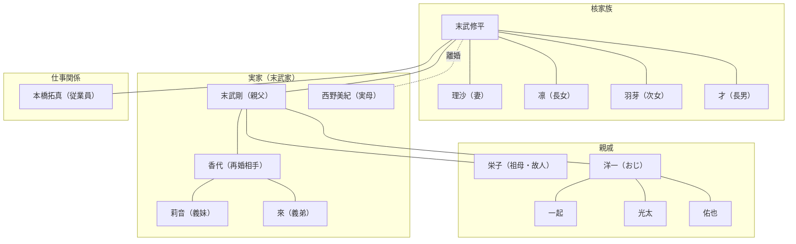

# 末武修平の人間関係マップ

最終更新: 2025-12-06

---

## 関係図



---

## クイックリファレンス

### 核家族

| 名前 | 読み | 関係 | 備考 |
|------|------|------|------|
| 理沙 | りさ | 妻 | 結婚約10年 |
| 凛 | りん | 長女 | |
| 羽芽 | うめ | 次女 | |
| 才 | さい | 長男 | |

### 実家（末武家）

| 名前 | 呼び方 | 関係 | 備考 |
|------|--------|------|------|
| 末武剛 | 親父 | 父 | 職人（建設業） |
| 西野美紀 | - | 実母 | 旧姓：末武、親父と離婚 |
| 末武香代 | かよちゃん | 父の再婚相手 | |
| 末武莉音 | - | 義理の妹 | 香代の娘、來の姉 |
| 末武來 | らい | 義理の弟 | 香代の息子 |

### 親戚（父方）

| 名前 | 関係 | 備考 |
|------|------|------|
| 末武栄子 | 祖母 | 剛の母、佐渡、2025年他界 |
| 末武洋一 | おじ | 剛の兄、工務店継承 |
| 一起 | いとこ | 洋一の長男 |
| 光太 | いとこ | 洋一の次男 |
| 佑也 | いとこ | 洋一の三男 |

### 仕事関係

| 名前 | 所属 | 役割 |
|------|------|------|
| 本橋拓真 | SKコーム | 従業員 |

---

## フォルダ構造

```
人物関係/
├── _INDEX.md           ← このファイル
├── _RELATIONSHIPS.yaml ← 機械可読な関係性定義
├── _TEMPLATE_人物プロファイル.md
│
├── 家族/
│   ├── 核家族/         ← 妻・子供
│   ├── 実家/           ← 父・母・義理の兄弟
│   └── 親戚/           ← おじ・祖母・いとこ
│
├── 仕事関係/           ← 従業員
│
└── 友人/
```

---

## 更新履歴

| 日付 | 内容 |
|------|------|
| 2025-12-06 | 本人確認により全情報を更新 |
