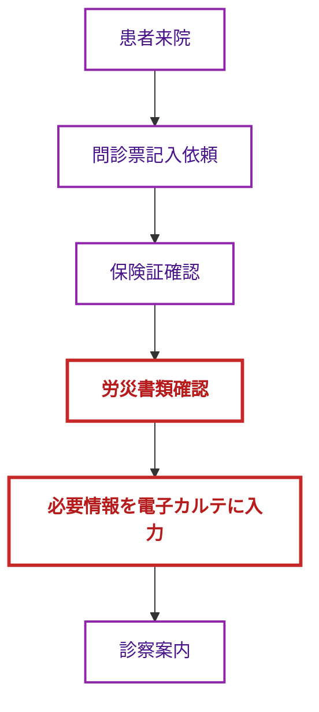
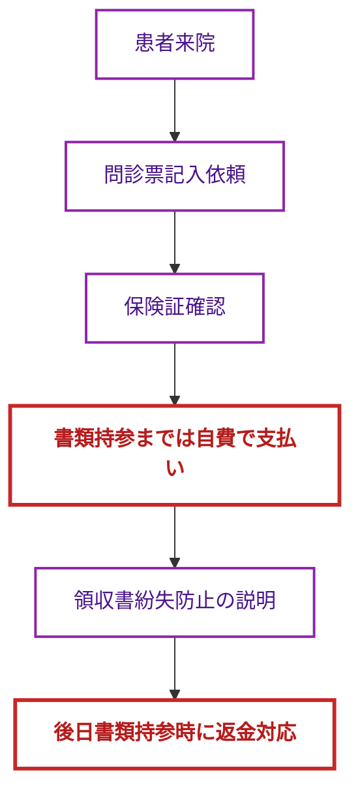
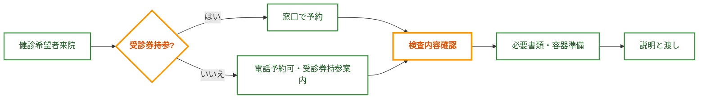
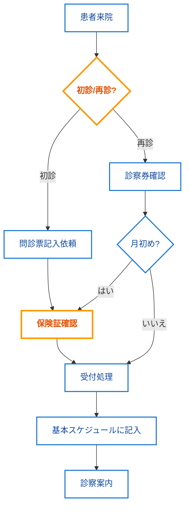
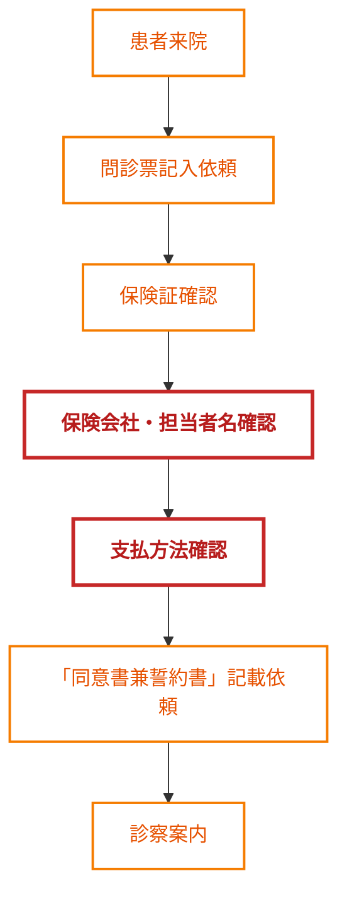
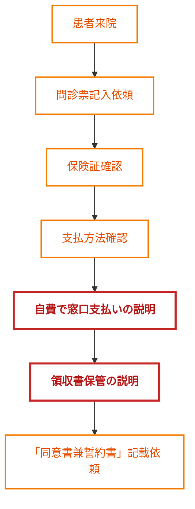
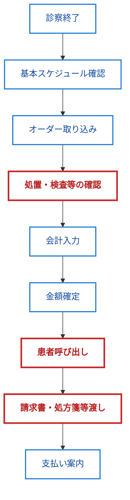

# 医療事務 外来受付業務マニュアル

> **使用にあたっての注意事項**  
> 本マニュアルでは下記の表記を用いて情報源を明確化しています：
> - 【資料】：プロジェクトナレッジ資料から直接抽出した情報
> - 📝：業務効率化のための補足情報（資料には明示されていない内容）

## 1. 労災保険の受付対応フロー

### 労災書類を持参している場合

#### 【資料】入力必須項目
- 労災保険番号
- 負傷または発病年月日
- 事業所の名称
- 事業所の所在地

> ⚠️ 【資料】**重要**: 保険証は使用できませんが、正確なカルテ作成のため確認は必須です

### 【資料】労災書類を持参していない場合

> 📝 **接遇ポイント**: 「労災書類をお持ちいただくまでは一時的に自費でのお支払いとなります。後日返金のため、領収書は大切に保管してください」

### 【資料】労災申請に必要な書類例
| 災害の種類 | 初診時の書類 | 転医時の書類 |
|------------|--------------|--------------|
| 業務災害 | 様式第5号 | 様式第6号 |
| 通勤災害 | 様式第16号の3 | 様式第16号の4 |

## 2. さいたま市の健康診断

### 【資料】健診の種類と対象者

#### 毎年受けられる健診
- 大腸がん検診（検便検査）- 費用: 400円
- 肺がん検診（胸部X線）- 費用: 600円
- 胃がん検診（内視鏡またはX線）- 費用: 1,000円

#### 2年に1度の健診
- 乳がん検診（触診・マンモグラフィー）- 費用: 1,000円
- 前立腺がん検診（採血）- 50歳以上の男性で前年度未受診の方

#### 特定年齢対象の健診
- 骨粗鬆症検診 - 40歳、45歳、50歳から80歳の女性（特に前年度未受診の方）

### 【資料】費用免除対象者
- 70歳以上の方（昭和30.3.31以前生まれ）→ 無料
- 年度末年齢で70歳以上の方（受診日時点で69歳でも対象）→ 無料
- 65歳以上は肺がん・結核健診が無料（昭和35.3.31以前生まれ）

### 【資料】非課税世帯の証明書類（いずれか）
1. 介護保険負担限度額認定証
2. 後期高齢者医療限度額適用・標準負担額減額認定証
3. 予防接種用の証明書
4. 診療依頼書または保護受給証明書（生活保護世帯）

> 📝 **受付ポイント**: 健診前日には「特定または後期健診チェック表」に名前（カタカナ）、生年月日、年齢、健診日、IDを記入し、予約健診項目に○印をつけておきましょう

## 3. 外来受付の基本フロー

### 【資料】受付の流れ

### 【資料】患者誤認防止のポイント
- **受付時**: 保険証・問診票の氏名を必ず確認
- **保険証返却時**: 保険証が本人のものか再確認（本人に氏名・生年月日を言ってもらうのが理想）
- **会計時**: 患者を氏名または受付番号で呼び、処方箋の名前を確認してから渡す
- **書類確認**: 受付用紙と問診票、電子カルテの情報に相違がないか確認

> ⚠️ 【資料】**重要**: 患者誤認はゼロを目指しましょう！

### 【資料】感染症対策
- 風症状の患者は発熱外来での対応（予約確認）
- 各種消毒の徹底

## 4. 交通事故患者の対応

### 【資料】保険会社一括対応の場合

> 📝 **説明ポイント**: 「保険会社一括対応の場合でも、診断書以外や私病の治療については患者様負担が発生することがあります」

### 【資料】患者自身が支払う場合

## 5. 生活保護患者の対応

### 【資料】受給証または医療券持参の場合
- 初診時または6ヶ月以上来院がない場合は問診票記入依頼
- 医療券の氏名・住所・生年月日・承認期間等を確認
- 受給証の両面をスキャンし、電子カルテに取り込み

### 【資料】受給証または医療券不所持の場合
- 福祉事務所等へ医療扶助か確認の連絡
- 診療予定であることを伝え、医療券送付依頼

## 6. 会計業務の流れ

### 【資料】会計時の確認ポイント
- 請求書、診療明細書、処方箋、診察券に間違いがないこと
- 口頭だけでなく、請求書の氏名を指さしながら本人確認
- 未収・追加・返金がある場合はPOSレジへ案内

> 📝 **接遇ポイント**: 会計時は「○○様、お会計のご案内です」と明るく丁寧に声をかけましょう

## 7. 予防接種の受付対応

### 【資料】インフルエンザ予防接種（予約制）
- 対象者確認: 65歳以上、または60～65歳未満で特定疾患の方
- 予診票記入依頼、体温測定
- 助成対象者確認（住所・年齢・証明書類）

### 【資料】肺炎球菌予防接種（予約制）
- 65歳から始まり、5歳毎の定期接種
- 60～65歳未満の特定疾患の方（身体障害者手帳1級の提示必要）
- 初回接種: 4,600円（さいたま市助成）、2回目以降: 8,800円（当院価格）

## 8. 書類対応の基本

### 【資料】災害共済給付関連書類
- 学校管理下での怪我・事故に適用
- 診療報酬点数500点以上で記入可能（1か月の診療につき1枚）
- 医療費の4割分が給付される

### 【資料】生活保護法による移送費申請
- 受診確認書に受診日を確認し、該当日に院長印を押す
- 医療機関の所在地・名称の入った印を押す
- 患者氏名、受診年月、申請書は患者が記入

---

## 業務チェックリスト

### 【資料】始業時
- [ ] 受付前待合室・医事課内清掃
- [ ] PC立ち上げ
- [ ] 発熱外来準備（鍵開け、PC立ち上げ、エアコン起動）

### 【資料】終業時
- [ ] 外来診療終了までの会計入力・窓口対応
- [ ] レジ締め作業
- [ ] 事務当直への引き継ぎ

### 【資料】適宜確認
- [ ] 患者情報の守秘義務を徹底
- [ ] 文書保存期間のルールに従った管理
- [ ] 診療録の適正な記載と保存

---

> **参照資料一覧**
> - 20250426_2年に1度のがん検診（はがきで確認できるが、2，3月に健診を実施している場合マー.pdf
> - 20240821_053文書管理.pdf
> - 20240425_①労災書類を持参している場合.pdf
> - 20240401_(タイトル).pdf
